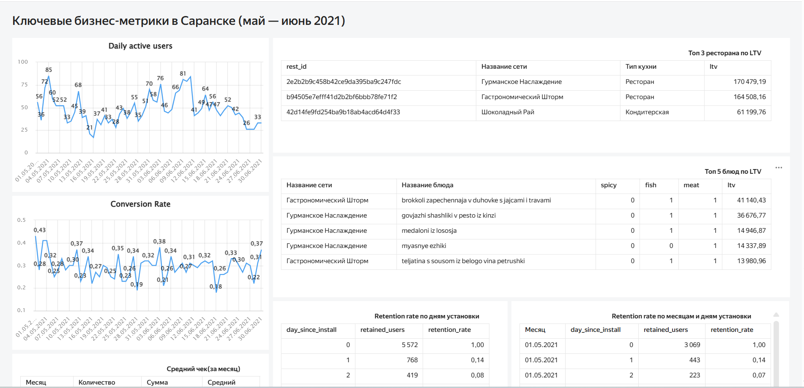

# Ключевые бизнес-метрики сервиса доставки еды «Всё.из.кафе»

## Цели проекта
Подготовка данных и визуализация ключевых метрик сервиса «Всё.из.кафе». 
1. Разработать дашборд, который с разных сторон отразит состояние клиентской базы в городе Саранске.
2. На основе этого дашборда необходимо составить аналитический отчёт.

## Задачи
1. **Подготовить QL-запросы в DataLens для визуализации следующих метрик:**
DAU (от англ. daily active users) — количество активных пользователей за день.
Conversion Rate — коэффициент конверсии.
Средний чек — средняя сумма покупки на пользователя.
LTV (от англ. lifetime value) — совокупная ценность клиента за период.
Retention Rate — коэффициент удержания пользователей.

2. **Создать визуализации в DataLens:**
Для каждой метрики подготовить график для наглядного анализа. Например, линейные тренды, диаграммы или таблицы.
Убедиться, что визуализации отражают динамику показателей, а также позволяют выявлять закономерности и аномалии.

3. **На основе этих запросов создать дашборд, который включает понятные графики для указанных выше метрик.**

4. **Проанализировать результаты визуализаций и подготовить выводы в аналитической записке для старшего аналитика.**
Она должна включать выводы по каждой метрике за период с начала мая до конца июня. Что отразить в записке:
Увеличивается или снижается DAU?
Наблюдаются ли аномалии в конверсии?
Как меняется средний чек с течением времени?
Как меняется Retention Rate в зависимости от периода?

## Описание данных

Проект анализирует сервис доставки еды «Всё.из.кафе». Данные охватывают период с 30.04.2021 по 02.07.2021 и включают журнал событий, рекламные затраты и справочную информацию.

### Таблица `analytics_events`
| Поле | Тип | Описание |
|------|-----|----------|
| `visitor_uuid` | string | Уникальный идентификатор посетителя |
| `user_id` | string | ID зарегистрированного пользователя |
| `device_type` | string | Тип платформы (iOS/Android/Web) |
| `city_id` | int | Город пользователя |
| `age` | string | Возрастная группа пользователя |
| `source` | string | Рекламный источник привлечения |
| `first_date` | date | Дата первого посещения |
| `visit_id` | string | Уникальный идентификатор сессии |
| `event` | string | Тип аналитического события |
| `datetime` | datetime | Дата и время события |
| `log_date` | date | Дата события |
| `rest_id` | string | ID сети ресторана |
| `object_id` | string | ID блюда |
| `listing_id` | string | ID блюда в листинге |
| `position` | int | Позиция блюда на странице ресторана |
| `order_id` | string | Уникальный идентификатор заказа |
| `revenue` | float | Выручка от заказа (руб.) |
| `delivery` | float | Стоимость доставки (руб.) |
| `commission` | float | Комиссия сервиса (руб.) |

**Типы событий:**
- `main_page` — посещение главной страницы
- `authorization` — авторизация
- `rest_page` — просмотр страницы ресторана
- `object_page` — просмотр карточки блюда
- `order` — оплата заказа

### Таблица `advertisement_budgets`
| Поле | Тип | Описание |
|------|-----|----------|
| `source` | string | Рекламный источник |
| `date` | date | Дата затрат |
| `budget` | float | Дневной бюджет (руб.) |

### Таблица `partners`
| Поле | Тип | Описание |
|------|-----|----------|
| `rest_id` | string | ID сети ресторана |
| `chain` | string | Название сети |
| `type` | string | Тип кухни |
| `city_id` | int | Город ресторана |
| `commission` | float | Комиссия в процентах |

### Таблица `dishes`
| Поле | Тип | Описание |
|------|-----|----------|
| `object_id` | string | ID блюда |
| `name` | string | Название блюда |
| `spicy` | int | Острое блюдо (1 - да, 0 - нет) |
| `fish` | int | Содержит морепродукты (1 - да, 0 - нет) |
| `meat` | int | Содержит мясо (1 - да, 0 - нет) |
| `rest_id` | string | ID ресторана |

### Таблица `cities`
| Поле | Тип | Описание |
|------|-----|----------|
| `city_id` | int | ID населённого пункта |
| `city_name` | string | Название города |

---

### Связи между таблицами
- `analytics_events.city_id` → `cities.city_id`
- `analytics_events.rest_id` → `partners.rest_id`
- `analytics_events.object_id` → `dishes.object_id`
- `partners.city_id` → `cities.city_id`
- `dishes.rest_id` → `partners.rest_id`

## Используемый стек
- **SQL**(Postgre)
- **Datalens**

## Ссылка на дашборд
📊 **Интерактивный дашборд доступен по ссылке:** [Посмотреть дашборд](https://datalens.yandex/opsea7jjhno69)

## Статус проекта
✅ Завершен

