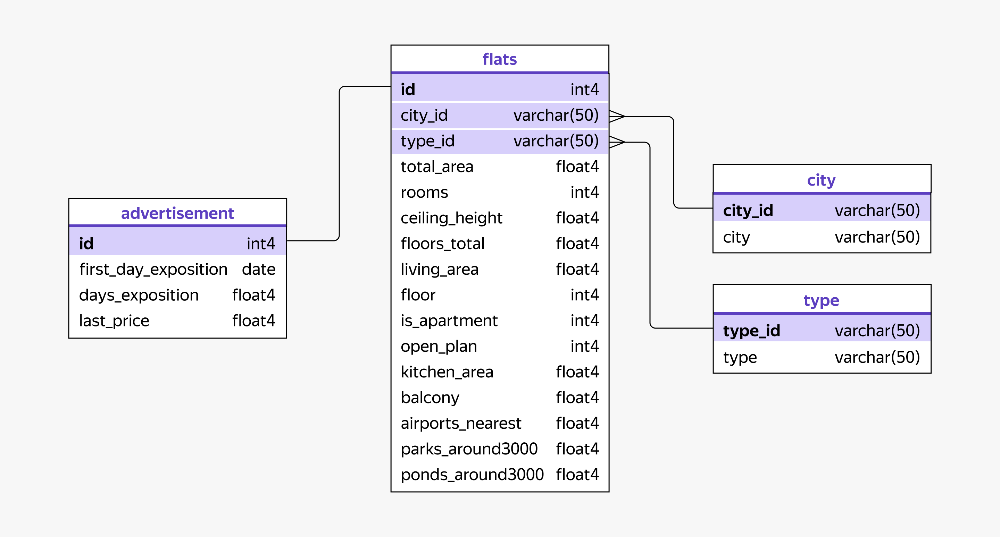

# Анализ рынка недвижимости Санкт-Петербурга и Ленинградской области

## Цели проекта
1. Определить наиболее привлекательные сегменты недвижимости для разработки бизнес-стратегии риелторского агентства.
2. Выявить сезонные тенденции на рынке недвижимости в регионе.
3. Определить перспективные населенные пункты ЛО с высокой активностью продаж.

## Описание данных

### Таблица `advertisement`
| Поле | Тип | Описание |
|------|-----|----------|
| `id` | int | Идентификатор объявления (PK) |
| `first_day_exposition` | date | Дата подачи объявления |
| `days_exposition` | int | Длительность нахождения на сайте (дни) |
| `last_price` | float | Стоимость квартиры (руб.) |

### Таблица `flats`
| Поле | Тип | Описание |
|------|-----|----------|
| `id` | int | Идентификатор квартиры (PK, FK → advertisement.id) |
| `city_id` | int | Идентификатор города (FK → city.city_id) |
| `type_id` | int | Идентификатор типа населённого пункта (FK → type.type_id) |
| `total_area` | float | Общая площадь (м²) |
| `rooms` | int | Число комнат |
| `ceiling_height` | float | Высота потолков (м) |
| `floors_total` | int | Этажность дома |
| `living_area` | float | Жилая площадь (м²) |
| `floor` | int | Этаж квартиры |
| `is_apartment` | int | Апартаменты (1 - да, 0 - нет) |
| `open_plan` | int | Открытая планировка (1 - да, 0 - нет) |
| `kitchen_area` | float | Площадь кухни (м²) |
| `balcony` | int | Количество балконов |
| `airports_nearest` | float | Расстояние до аэропорта (м) |
| `parks_around3000` | int | Парки в радиусе 3 км |
| `ponds_around3000` | int | Водоёмы в радиусе 3 км |

### Таблица `city`
| Поле | Тип | Описание |
|------|-----|----------|
| `city_id` | int | Идентификатор населённого пункта (PK) |
| `city` | varchar | Название населённого пункта |

### Таблица `type`
| Поле | Тип | Описание |
|------|-----|----------|
| `type_id` | int | Идентификатор типа населённого пункта (PK) |
| `type` | varchar | Название типа |

## Структура базы данных

## Используемый стек
- **SQL**
- **Datalens**

## Этапы работы
1. Загрузка и предобработка данных
2. Исследовательский анализ (EDA)
3. Анализ сезонности и трендов
4. Сравнительный анализ СПб и ЛО
5. Формулировка выводов и рекомендаций

## Статус проекта
✅ Завершен
